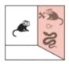
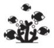

# BrAInVR

BrAInVR develops experimental platforms and AI-based behavioral analysis tools for studying social interactions in animal groups.

The project combines real-time tracking, deep learning, virtual reality and automated behavioral analysis across four complementary platforms.

---

## Virtual Reality Platforms

-   { width="64" }

    ## [MarmoVR](marmovr/index.md)

    Virtual Reality platform for freely moving marmosets.

-   { width="64" }

    ## [NemoVR](nemovr/index.md)

    Virtual Reality platform for reef fish.

---

## Naturalistic Recording Platforms

-   { width="64" }

    ## [MarmoRoomRecord](marmoroomrecord/index.md)

    Multi-camera recording system for naturalistic social interactions in groups of marmosets.

-   { width="64" }

    ## [NemoReefRecord](nemoreefrecord/index.md)

    Underwater recording system for naturalistic social interactions in reef fish communities.

---

## Project Partners

| Institution | Location |
|------------|----------|
| Institut de Neurosciences de la Timone (INT) | Marseille, France |
| CRIOBE | Moorea, French Polynesia |
| EPFL | Lausanne, Switzerland |