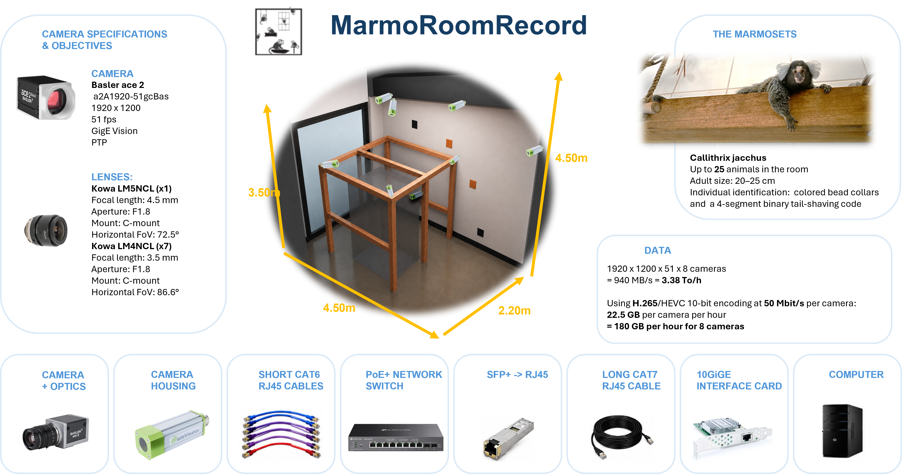

# MarmoRoomRecord

  <strong>
    Naturalistic multi-camera recording of captive marmoset groups in an indoor living environment
  </strong>

MarmoRoomRecord is a synchronized multi-camera platform designed to record and study the spontaneous behaviour and social interactions of freely moving marmosets living together as a captive group.

## Platform overview

  

  <em>
    Current configuration of the MarmoRoomRecord system installed in the indoor living room of a captive marmoset group.
  </em>

The system is permanently installed in the animals' usual indoor living room. Eight cameras positioned around the room provide synchronized views of the animals as they move, rest and interact within their social group.

!!! note "Development status"
    MarmoRoomRecord is currently under development.  
    The camera installation, synchronization system, acquisition software and automated animal-tracking pipeline are being tested and refined.

---

## Current configuration

| Component | Description |
|---|---|
| Recording environment | Indoor captive living room housing a stable social group of marmosets |
| Animal conditions | Animals move and interact freely within their usual group living environment |
| Installed cameras | 8 synchronized Basler GigE cameras positioned around the room |
| Camera model | Basler ace 2 a2A1920-51gcBAS |
| Image resolution | 1920 × 1200 pixels |
| Acquisition rate | 50 frames per second |
| Camera synchronization | Network-based synchronization using Precision Time Protocol |
| Network infrastructure | PoE+ Ethernet switch connected to the acquisition computer through a long Cat 7 Ethernet cable and a 10 Gigabit Ethernet link |
| Acquisition computer | Dedicated computer located in a separate analysis room for camera control, synchronized recording and data storage |
| Recording subjects | Captive groups of common marmosets living together in an indoor room |
| Deployment site | Marmoset Primatology and Research Centre, Marseille, France |

---

## Animal identification

Individual marmosets can be identified using visual markers that remain visible from several camera viewpoints.

Depending on the animals and the recording conditions, identification methods may include:

- coloured bead collars;
- naturally distinctive physical features;
- shaved sections of the tail using a four-segment binary identification code.

These visual identifiers support individual recognition during manual annotation and automated multi-animal tracking.

---

## Scientific objectives

MarmoRoomRecord is designed to:

- continuously record the spontaneous behaviour of captive marmoset groups;
- study naturalistic social interactions within a stable social group;
- observe locomotion, proximity, grooming, resting and other social behaviours;
- identify and track multiple individuals simultaneously;
- reconstruct animal trajectories in three dimensions;
- estimate body posture and orientation from synchronized camera views;
- quantify spatial organisation and social relationships within the group;
- generate long-duration datasets for behavioural analysis;
- provide naturalistic behavioural data for the development and validation of MarmoVR experiments.