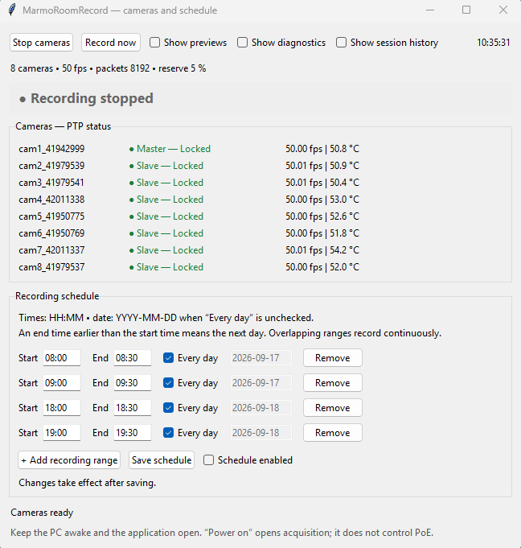

# Software

MarmoRoomRecord is operated through a lightweight graphical interface designed for routine multi-camera recording sessions.

The acquisition software, source code, configuration files and technical development documentation are maintained in the dedicated repository:

**[ANR-BrAInVR / MarmoRoomRecord](https://github.com/ANR-BrAInVR/MarmoRoomRecord)**

This page is intentionally limited to the **operator workflow**. Implementation details and the current software architecture should be taken from the code repository above.

---

## Operator interface

The main window provides access to camera connection and status, preview and diagnostics, recording controls, and scheduled acquisition.

---

## Quick procedure

### 1. Open the GUI

Start **MarmoRoomRecord** on the acquisition computer. The main window opens and provides the controls required for the recording session.

### 2. Turn on and connect the cameras

Power on the camera system and connect the cameras from the GUI.

Before starting a recording, check the status indicators for each camera. In particular, verify that the expected cameras are detected and that the synchronization/status indicators report a normal state.

### 3. Preview and diagnostics

Use **Preview** to visually check the camera streams before acquisition.

Use the diagnostic information to verify the acquisition state, including camera status, synchronization and temperature. This step should be performed before every experimental session.

### 4. Program the recording schedule

Use **Schedule** to define the recording sequence for the experiment.

The scheduler is used to program the acquisition periods in advance rather than manually starting and stopping every recording session. Check the programmed sequence before launching it.

### 5. Start and monitor acquisition

Start the programmed acquisition from the GUI and verify that the recording indicator changes to the expected active state.

During acquisition, the interface can be used to monitor the cameras and detect abnormal acquisition conditions.

---

## Output data

Recordings are written to the dedicated **`Recordings/`** directory outside the source-code directory.

The output is organized by recording session, with the camera recordings kept separately so that each stream can subsequently be associated with its physical camera and synchronized with the other views.

The exact current file naming convention, recording format and metadata structure are defined by the acquisition software and may evolve during development. The **MarmoRoomRecord repository is the reference** for these implementation details:

**[github.com/ANR-BrAInVR/MarmoRoomRecord](https://github.com/ANR-BrAInVR/MarmoRoomRecord)**

---

## Development and configuration

For installation, dependencies, `settings.json`, camera configuration, source-code architecture, recording implementation and development notes, refer directly to the code repository rather than duplicating information here:

**[MarmoRoomRecord source code and technical documentation](https://github.com/ANR-BrAInVR/MarmoRoomRecord)**
