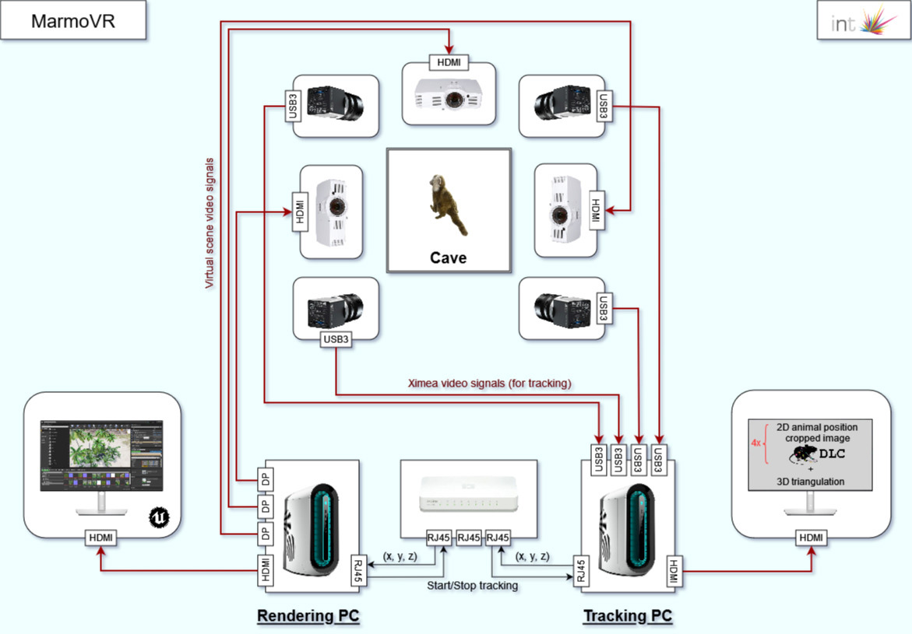
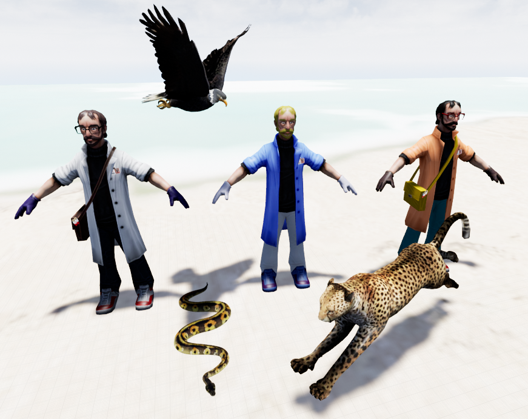

# MarmoVR

MarmoVR is an immersive Virtual Reality platform developed for behavioral experiments in freely moving marmosets.

The system combines real-time tracking, pose estimation, virtual environment rendering and automated behavioral analysis in a closed-loop experimental framework.

---

## Overview

MarmoVR is composed of two interconnected computers.

| Computer     | Operating System | Main Responsibilities                              |
| ------------ | ---------------- | -------------------------------------------------- |
| Tracking PC  | Ubuntu Linux     | Detection, tracking, DeepLabCut, 3D reconstruction |
| Rendering PC | Windows          | Unreal Engine, nDisplay, experiment control        |

The platform is organized around four main software modules.

| Module      | Computer     | Role                                                 |
| ----------- | ------------ | ---------------------------------------------------- |
| Calibration | Tracking PC  | Camera calibration and system setup                  |
| Tracking    | Tracking PC  | Real-time detection, tracking and pose estimation    |
| Rendering   | Rendering PC | VR environment rendering with Unreal Engine          |
| Viewer      | Rendering PC | Experiment replay, visualization and post-processing |

---

## System Diagram

---

## Documentation

-   

    ## Quick Start

    Learn how to start the complete MarmoVR system and launch an experiment.

    [Open Quick Start](quick-start.md)

-   

    ## Hardware

    Description of the cave, cameras, lenses, computers, projectors and network architecture.

    [Open Hardware](hardware.md)

-   

    ## Software

    Overview of the tracking, rendering, calibration and viewer software modules.

    [Open Software](software.md)

-   

    ## Troubleshooting

    Common issues, checks and recovery procedures.

    [Open Troubleshooting](troubleshooting.md)

## Software Modules

| Module         | Computer     | Repository                                                   | Documentation |
| -------------- | ------------ | ------------------------------------------------------------ | ------------- |
| 🎯 Calibration | Tracking PC  | [GitHub](https://github.com/ANR-BrAInVR/MarmoVR-Calibration) | Coming soon   |
| 🐒 Tracking    | Tracking PC  | [GitHub](https://github.com/ANR-BrAInVR/MarmoVR-Tracking)    | Coming soon   |
| 🧊 Rendering   | Rendering PC | [GitHub](https://github.com/ANR-BrAInVR/MarmoVR-Rendering)   | Coming soon   |
| 🖥️ Viewer     | Rendering PC | [GitHub](https://github.com/ANR-BrAInVR/MarmoVR-Viewer)      | Coming soon   |

---

!!! info
MarmoVR is under active development. Documentation will be updated progressively as each software module is stabilized.
