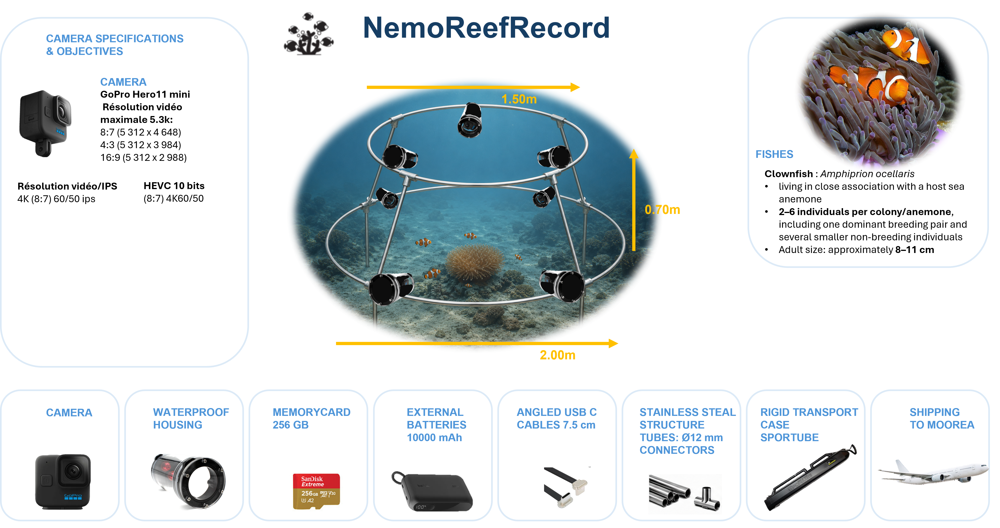

# NemoReefRecord

  <strong>
    Naturalistic multi-camera recording of reef fish communities
  </strong>

NemoReefRecord is an underwater multi-camera platform designed to record and study the spontaneous behaviour and social interactions of reef fish communities under natural conditions.

## Platform overview

  

  <em>
    Current configuration of the NemoReefRecord underwater recording platform.
  </em>

The system uses a rigid multi-camera structure positioned around a reef area to obtain synchronized views of fish, corals and sea anemones in their natural environment.

!!! note "Development status"
    NemoReefRecord is currently under development.  
    The mechanical structure, waterproof camera modules and acquisition protocol are being tested and refined.

---

## Current configuration

| Component | Description |
|---|---|
| Camera structure | Two concentric stainless-steel rings connected by four support bars |
| Installed cameras | 7 underwater camera modules: 4 on the lower ring and 3 on the upper ring |
| Camera module | GoPro HERO11 Black Mini, 10,000 mAh external battery and angled USB-C cable |
| Waterproof housing | Blue Robotics cylindrical enclosure with a flat transparent front window |
| Recording subjects | Reef fish communities, clownfish, corals and sea anemones |
| Transport | Fully demountable structure transported in a rigid protective case |
| Deployment site | Moorea, French Polynesia |

---

## Scientific objectives

NemoReefRecord is designed to:

- record naturalistic interactions between reef fish;
- observe clownfish behaviour around sea anemones;
- reconstruct animal trajectories in three dimensions;
- quantify spatial and social interactions between individuals;
- generate datasets for behavioural analysis and virtual-reality applications.