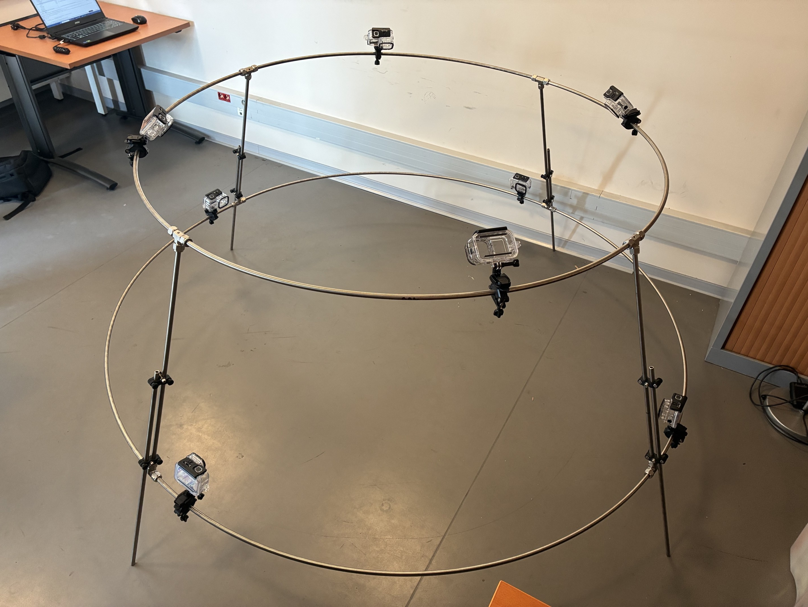
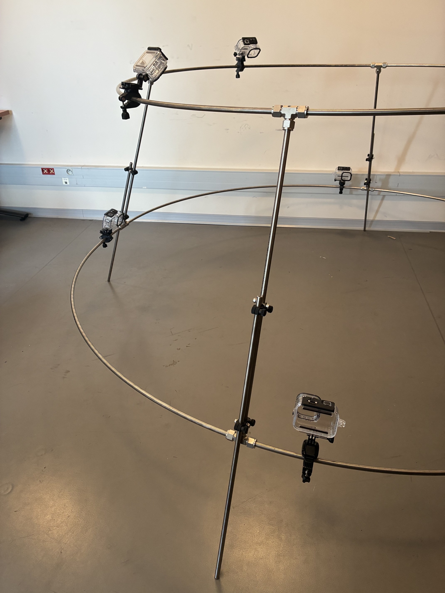
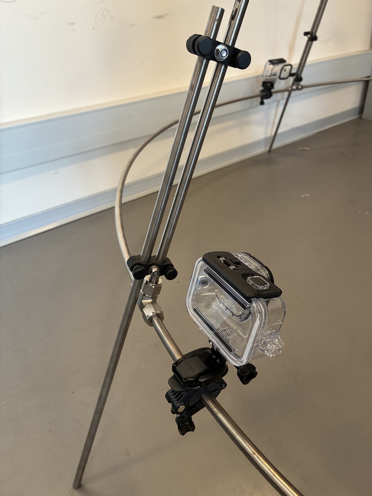

# NemoReefRecord

  <strong>
    Naturalistic multi-camera recording of reef fish communities
  </strong>

NemoReefRecord is an underwater multi-camera platform designed to record and study the spontaneous behaviour and social interactions of reef fish communities under natural conditions.

## Platform overview

  

  <em>
    NemoReefRecord underwater multi-camera acquisition platform.
  </em>

The system uses a rigid multi-camera structure positioned around a reef area to obtain synchronized views of fish, corals and sea anemones in their natural environment.

The target configuration uses **8 GoPro Mission 1 cameras**. Camera settings, clock synchronization and autonomous recording sequences are programmed using **GoPro Labs QR codes**.

!!! note "Development status"
    NemoReefRecord is currently under development.  
    The mechanical structure, waterproof camera modules and acquisition protocol are being tested and refined. The complete 8-camera configuration remains to be validated.

---

## Current configuration

| Component | Description |
|---|---|
| Camera structure | Two concentric stainless-steel rings connected by four support bars |
| Camera system | **8 GoPro Mission 1 cameras** |
| Recording configuration | **4K 4:3, 60 fps, Wide, 8-bit, stabilization OFF** |
| Recording protocol | **10 min recording / 10 min pause**, programmed using GoPro Labs |
| Camera synchronization | QR-based clock synchronization with GoPro Labs |
| Power | **10,000 mAh external battery per camera** |
| Recording subjects | Reef fish communities, clownfish, corals and sea anemones |
| Transport | Fully demountable structure transported in a rigid protective case |
| Deployment site | Moorea, French Polynesia |

For camera configuration and recording procedures, see the **[NemoReefRecord Quickstart](quickstart.md){ target="_blank" rel="noopener" }**. Experimental validation is documented on the **[NemoReefRecord Tests](tests.md){ target="_blank" rel="noopener" }** page.

---

## Data production

For the current GoPro Mission 1 recording configuration, measured storage usage is approximately **4.3 GB per camera every 10 minutes of recorded video**.

This corresponds to approximately:

- **26 GB per camera per hour of recorded video**
- **208 GB per hour for 8 cameras**

With the current **10 min recording / 10 min pause** acquisition protocol, the effective storage requirement is approximately **104 GB per hour of deployment for 8 cameras**.

---

## Scientific objectives

NemoReefRecord is designed to:

- record naturalistic interactions between reef fish;
- observe clownfish behaviour around sea anemones;
- reconstruct animal trajectories in three dimensions;
- quantify spatial and social interactions between individuals;
- generate datasets for behavioural analysis and virtual-reality applications.

---

## Current laboratory setup

The current NemoReefRecord structure is assembled in the laboratory for camera positioning, field-of-view and acquisition tests.

  

  

    
    
  

