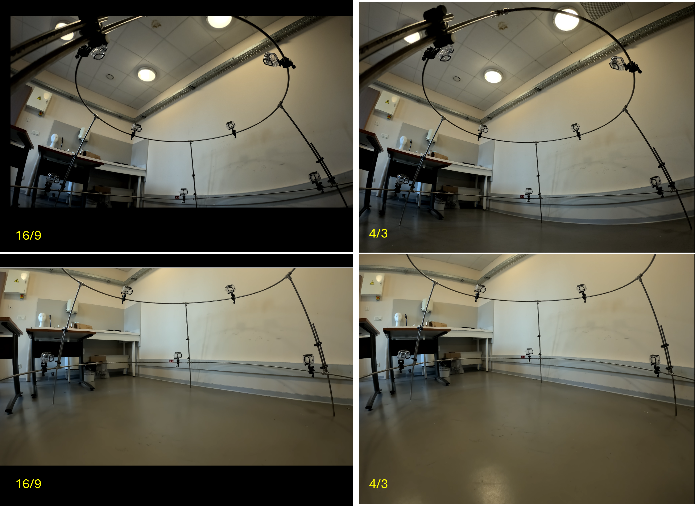
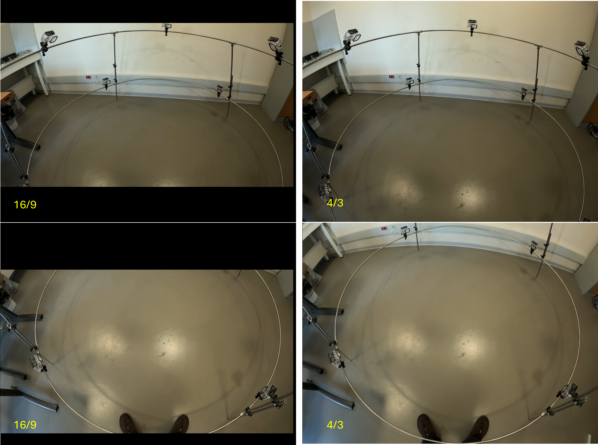

# NemoReefRecord Tests

This page documents the experimental tests performed during the development and validation of the NemoReefRecord acquisition system.

## 1. Recording tests

Recording tests were performed to evaluate camera autonomy, thermal behaviour and the GoPro Labs acquisition schedules.

| Test | Configuration | Cycle | Total recorded video | Main observation |
|---|---|---|---:|---|
| **24–25/09** | **8-bit, stabilization OFF** | **5 min REC / 35 min pause** | **≈ 45 min** | 9/24 sequences; ~8.0 GB. **Instruction did not continue past midnight.** |
| **24/09** | **8-bit, stabilization OFF** | **5 min REC / 15 min pause** | **≈ 1 h 30 min** | 18/24 sequences; ~21.8 GB |
| **23/09 pm** | **8-bit, stabilization OFF** | **10 min REC / 10 min pause** | **≈ 1 h 52 min** | 11 complete sequences + ~2 min; ~47 GB |
| **23/09 am** | **8-bit, stabilization OFF** | **10 min REC / 10 min pause** | **≈ 1 h 52 min** | 11 complete sequences + ~2 min; ~48.5 GB |
| **22/09 pm** | **10-bit** | **20 min REC / 1 min pause** | **≈ 1 h 39 min** | Probable battery depletion |
| **22/09 am** | **10-bit** | **20 min REC / 1 min pause** | **1 h 14 min 51 s** | Thermal shutdown |


### GoPro Labs instructions

??? info ":material-camera: 24–25/09 — 5 min REC / 35 min pause"
    ```text
    <18:15!18:15NmVr4Tp60fWd0e0g0oW0oV0oD0!S!2NoDO!298E!2N<l23!2098R
    ```

    !!! warning
        This instruction did not continue past midnight.

??? info ":material-camera: 24/09 — 5 min REC / 15 min pause"
    ```text
    <10:15!10:15NmVr4Tp60fWd0e0g0oW0oV0oD0!S!2NoDO!298E!2N<l23!898R
    ```

??? info ":material-camera: 23/09 pm — 10 min REC / 10 min pause"
    ```text
    <17:10!17:10NmVr4Tp60fWd0e0g0oW0oV0oD0!S!2NoDO!598E!2N<l17!598R
    ```

??? info ":material-camera: 23/09 am — 10 min REC / 10 min pause"
    ```text
    <09:00!09:00NmVr4Tp60fWd0e0g0oW0oV0oD0!S!2NoDO!598E!2N<l17!598R
    ```

??? info ":material-camera: 22/09 pm — 20 min REC / 1 min pause"
    ```text
    !13:25NmVr4Tp60fWd1g0oW0oV0oD0!S!2NoDO!1198E!2N!13:46N!S!2NoDO!1198E!2N!14:07N!S!2NoDO!1198E!2N!14:28N!S!2NoDO!1198E!2N!14:49N!S!2NoDO!1198E!2N!15:10N!S!2NoDO!1198E!2N!15:31N!S!2NoDO!1198E!2N!15:52N!S!2NoDO!1198E!2N!16:13N!S!2NoDO!1198E
    ```

??? info ":material-camera: 22/09 am — 20 min REC / 1 min pause"
    ```text
    !10:20NmVr4Tp60fWd1g0oW0oV0oD0!S!2NoDO!1198E!2N!10:41N!S!2NoDO!1198E!2N!11:02N!S!2NoDO!1198E!2N!11:23N!S!2NoDO!1198E!2N!11:44N!S!2NoDO!1198E!2N!12:05N!S!2NoDO!1198E!2N!12:26N!S!2NoDO!1198E!2N!12:47N!S!2NoDO!1198E!2N!13:08N!S!2NoDO!1198E
    ```


The two tests performed with the selected **8-bit / stabilization OFF / 10 min REC / 10 min pause** configuration both provided approximately **1 h 52 min of recorded video**, showing consistent recording autonomy across repeated tests.

This configuration is currently retained for NemoReefRecord and will next be validated simultaneously on the complete **8-camera system**.

!!! tip "Wi-Fi / iPhone setup"
    During Wi-Fi / iPhone configuration, **do not connect the GoPro to external power**.


## 2. Field-of-view tests

Field-of-view tests were performed to compare **16:9** and **4:3** recording formats and evaluate the coverage obtained from the upper and lower camera rings.

### Lower camera ring



The **4:3 format provides greater vertical coverage**, which is particularly useful for cameras observing the recording volume from the side.

### Upper camera ring



For the upper cameras, the **4:3 format increases the visible area around the acquisition volume** while maintaining coverage of the central region.

### Selected format

Based on these tests, **4K 4:3** was selected as the current recording format for NemoReefRecord.