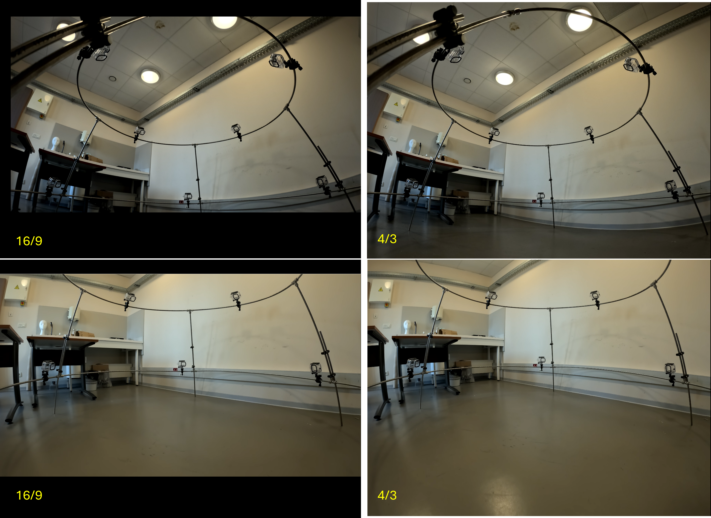
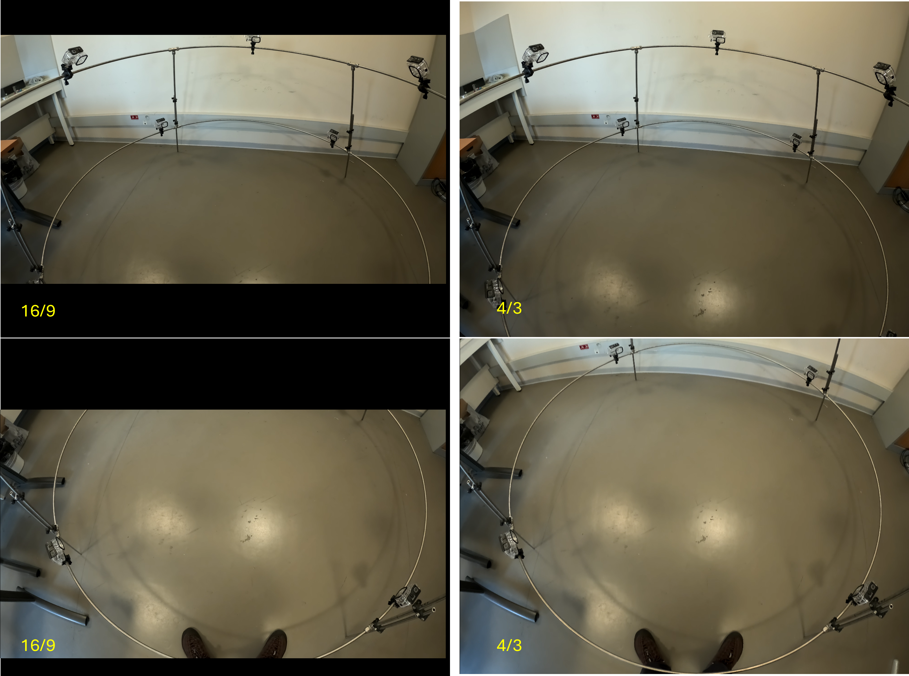

# Field-of-View Tests

Field-of-view tests were performed to determine the most appropriate recording format for the NemoReefRecord camera geometry.

The main comparison focused on **16:9** and **4:3** recording formats.

## Lower camera ring

The **4:3 format provides greater vertical coverage**, which is particularly useful for cameras observing the recording volume from the side.

The additional vertical field of view increases coverage of the experimental volume without requiring changes to the physical camera structure.

## Upper camera ring

For the upper cameras, the **4:3 format increases the visible area around the acquisition volume** while maintaining coverage of the central region.

## Selected format

Based on these tests, **4K 4:3** was selected as the current recording format for NemoReefRecord.

The current recording configuration is therefore:

| Parameter | Setting |
|---|---|
| Resolution | **4K** |
| Aspect ratio | **4:3** |
| Frame rate | **60 fps** |
| Lens | **Wide** |
| Bit depth | **8-bit** |
| Stabilization | **OFF** |

!!! success "Selected configuration"
    **4K 4:3 at 60 fps** provides the additional vertical field of view required by the NemoReefRecord geometry while retaining high spatial and temporal resolution.