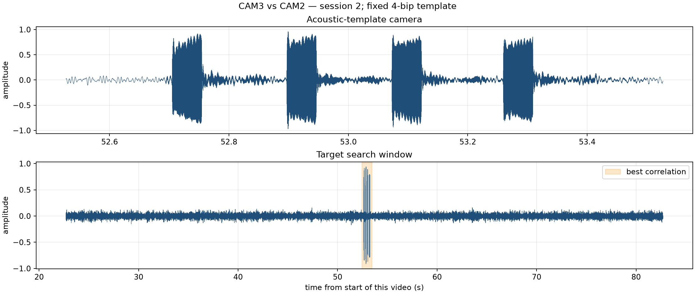
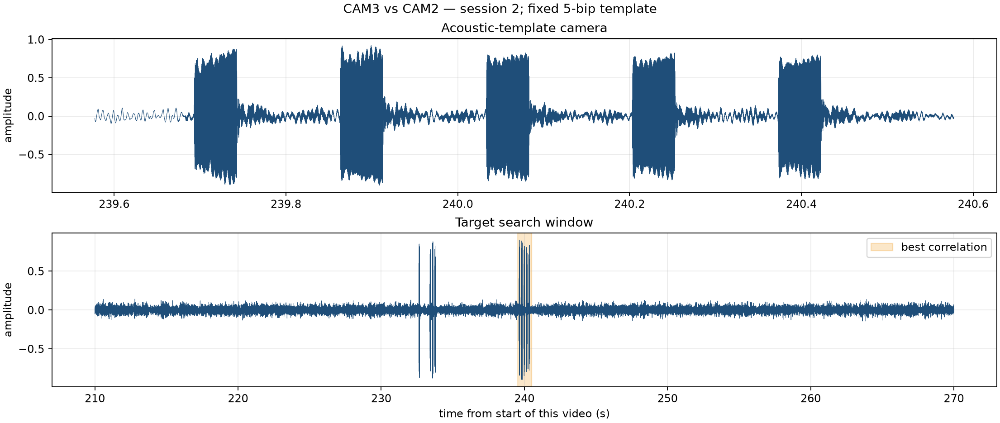
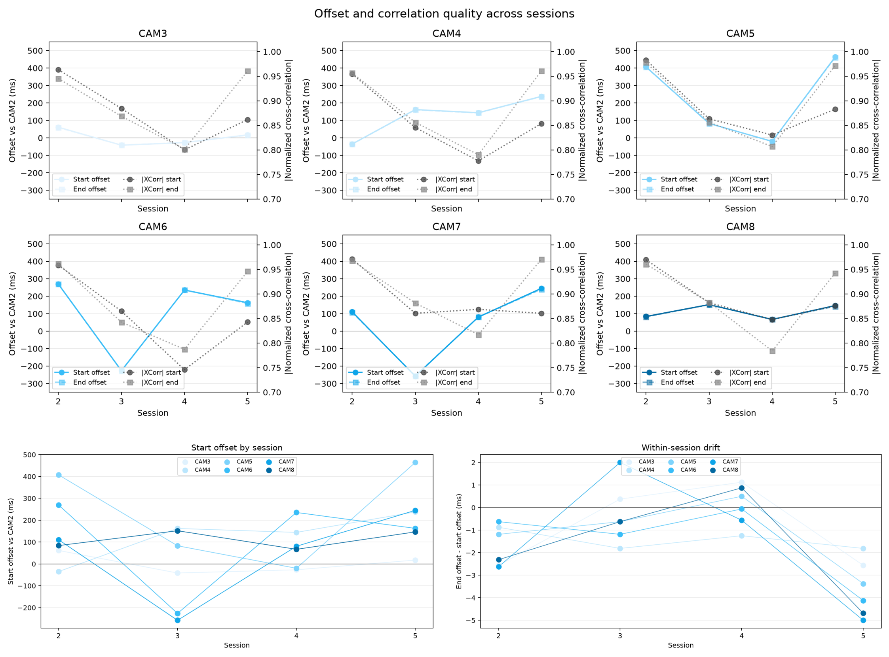
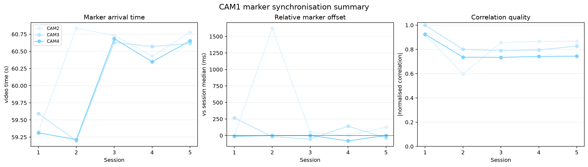
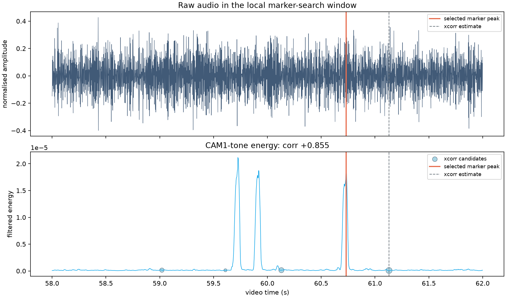
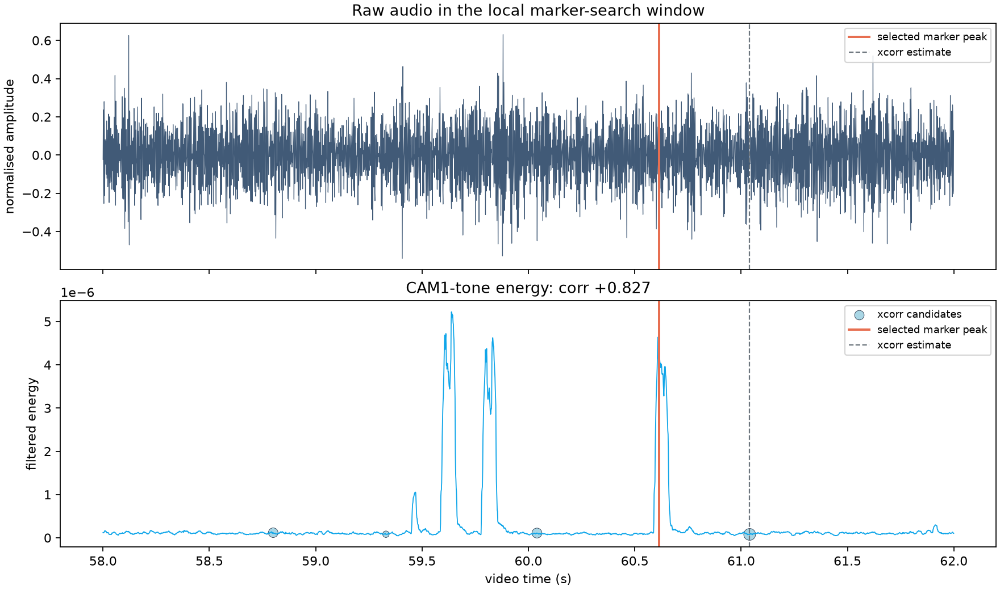
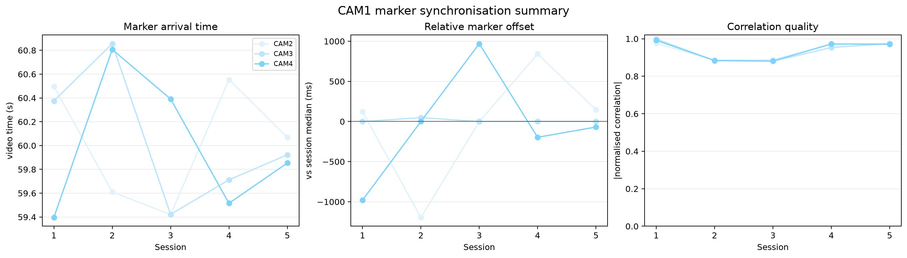
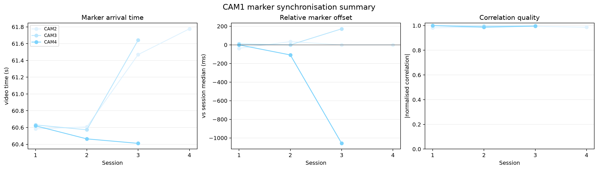
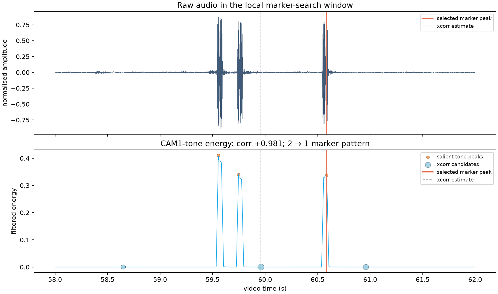
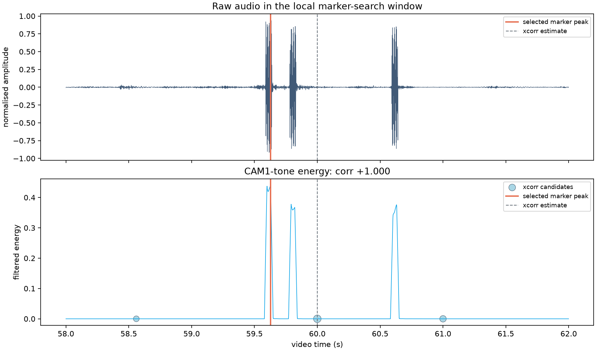

# Camera Synchronization Tests

This page documents the development and validation of the NemoReefRecord synchronization strategy.

The objective is to determine the actual temporal relationship between independently recording GoPro MISSION 1 cameras.

Three distinct effects are considered:

1. **initial recording offset** between cameras;
2. **within-recording clock drift**;
3. **sequence-to-sequence variability**.


## Clock synchronization and drift

### Precision Time drift test

A first drift-calibration test was performed using the GoPro Labs **Precision Time QR code**.

The procedure was:

1. synchronize the MISSION 1 internal clock using Precision Time;
2. enable automatic drift calibration:
   ```text
   *DRFT=1
   ```
3. leave the camera clock running for approximately **72 h**;
4. present a second Precision Time QR code;
5. inspect the recorded metadata.

The metadata confirms that:

```text
DRFT 1
```

is correctly stored by the MISSION 1.

However, no `DRFS` value was generated or found after the second synchronization.

The same behaviour was observed in a separate test using GPS clock synchronization with approximately **24 h** between two synchronization events.

A question has been opened in the official GoPro Labs discussions:

[GoPro Labs Discussion #1830 — MISSION 1 clock drift / DRFT / DRFS](https://github.com/gopro/labs/discussions/1830){ target="_blank" rel="noopener" }

!!! warning "DRFS availability on MISSION 1"
    `DRFT=1` is confirmed to be stored in MISSION 1 metadata, but no `DRFS` value has yet been observed after repeated Precision Time or GPS synchronization tests.

    Confirmation from the GoPro Labs developers is currently pending.


## External synchronization references

Two external tests provide useful context for multi-GoPro synchronization:

- [Reddit — Timecode synchronization and drift on GoPro HERO12](https://www.reddit.com/r/gopro/comments/18uxnv0/timecode_synchronization_and_drift_on_gopro_hero12/){ target="_blank" rel="noopener" }
- [YouTube — GoPro HERO12 timecode synchronization test](https://www.youtube.com/watch?v=Upz1ksiH_lE&t=572s){ target="_blank" rel="noopener" }

The Reddit experiment reports approximately **233 ms of relative drift after 90 min**, corresponding to about **14 frames at 60 fps**.

The linked YouTube experiment reports substantially better behaviour, approximately **within one frame over nearly two hours**.

!!! warning "Different camera model"
    These experiments used **GoPro HERO12** cameras.

    NemoReefRecord uses **GoPro MISSION 1** cameras, so these values are used only as methodological references.


# Acoustic synchronization

Because scheduling alone cannot guarantee frame-level synchronization, a dedicated acoustic reference strategy was developed.

One camera, **CAM1**, generates acoustic markers that are recorded by the other cameras.

The marker can then be detected during post-processing to determine the effective temporal relationship between recordings.


## Open-air relative-loop experiment

Eight MISSION 1 cameras executed five recording sessions.

CAM2–CAM8 recorded for **5 min**.

CAM1 started approximately **1 min later**, recorded for approximately **3 min**, and generated acoustic markers.

| CAM1 marker | Content | Use |
|---|---:|---|
| Start | 4 beeps | Initial alignment |
| End | 5 beeps | Drift measurement |

Session 1 was excluded because CAM1 did not emit the expected markers.

Sessions **2–5** were analysed.


### Analysis method

1. **Reference:** CAM2, session 2.
2. Initial marker positions (**52.7 s** and **240.0 s**) were used as anchors.
3. Each acoustic burst was re-detected within **±2 s** using its RMS envelope.
4. Fixed **1 s acoustic templates** were extracted.
5. Normalized cross-correlation searched for each template within **±30 s** in every target video.
6. Start and end offsets were measured independently.


### Example — start marker




### Example — end marker




### Results

All **24 camera/session pairs**, corresponding to **48 cross-correlations**, were usable.

Initial offsets varied between sessions by up to approximately **0.50 s**.

Within individual sequences, however, relative camera timing remained highly stable.

| Camera | Maximum start → stop variation |
|---|---:|
| CAM3 | 2.6 ms |
| CAM4 | 1.8 ms |
| CAM5 | 3.4 ms |
| CAM6 | 4.1 ms |
| CAM7 | **5.0 ms** |
| CAM8 | 4.7 ms |

At 60 fps, one frame corresponds to approximately **16.7 ms**.

The maximum observed timing change of **5.0 ms** was therefore substantially below one video frame.



!!! success "Main result"
    Sequence-to-sequence recording offsets can reach several hundred milliseconds.

    Once a sequence has started, however, relative camera timing remained stable to within only a few milliseconds.

    Each sequence must therefore be aligned independently.


# Absolute-scheduling synchronization tests — 7 October 2026

Three datasets from the absolute-scheduling experiments were analysed:

| Dataset | Environment | Scheduling | Sessions |
|---|---|---|---:|
| `test_drft4` | Underwater | Absolute | 5 |
| `test_drft5` | Underwater | Absolute | 5 |
| `test_drft6` | Open air | Absolute | Incomplete due to battery depletion |

For these experiments, CAM1 generated a single acoustic marker immediately after each programmed recording start.

The marker was searched in CAM2–CAM4.

The analysis estimates:

- marker arrival time within each video;
- relative marker offset between cameras;
- normalized cross-correlation quality.


## Underwater — `test_drft4`

The first dataset was acquired underwater using predefined absolute recording windows.




### Underwater marker detection examples

Underwater recordings contain substantial acoustic background and transient signals.

The CAM1 tone is therefore detected using its characteristic filtered energy in addition to the initial cross-correlation estimate.





These examples illustrate why raw cross-correlation alone is not always sufficient underwater.


## Underwater — `test_drft5`

The second underwater dataset used the same absolute scheduling strategy.



Marker arrival time again varies between cameras and between sessions despite the use of predefined absolute recording times.

The normalized cross-correlation values provide an additional quality-control metric for the automatic detections.


## Open air — `test_drft6`

The final analysed dataset was acquired in open air using absolute recording windows.

The acoustic conditions were substantially cleaner than underwater, allowing the CAM1 marker to be detected very reliably in CAM2–CAM4.




### Open-air marker detection examples

Individual CAM1 tones are clearly visible in the raw waveform and generate strong peaks in the filtered-energy signal.

The marker-selection algorithm identifies the characteristic CAM1 acoustic pattern and can correct the initial cross-correlation estimate when necessary.





For these examples, normalized correlations are approximately **0.98–1.00**, and the selected acoustic marker is clearly identifiable in the raw audio signal.

!!! success "Open-air marker detection"
    The `test_drft6` results validate reliable automatic detection of the CAM1 acoustic marker in the other cameras under open-air conditions.

    This provides the temporal landmark required for the next processing step: generating synchronized video sequences.


## From marker detection to synchronized videos

The next step is to use the detected acoustic markers to generate a new set of videos that share the same temporal origin.

Importantly, **CAM1 should not be trimmed at its acoustic marker**.

CAM1 is the reference camera and already contains useful video before the marker. This part of the recording should be preserved.


### Synchronization principle

For each session, the position of the acoustic marker must first be measured independently in CAM1, CAM2, CAM3 and CAM4.

For CAM1, the number of video frames between the beginning of the recording and the acoustic marker is determined:

```text
CAM1 start                     CAM1 marker
│                                  │
├──────── N reference frames ──────┤
│                                  │
frame 0                         frame N
```

This value defines the desired position of the marker in every synchronized video.

CAM1 remains unchanged.

CAM2–CAM4 are then trimmed so that their detected CAM1 marker occurs at exactly the same frame index `N`:

```text
                         CAM1 marker
                              │
CAM1  │───────────────────────│──────────────────────►
      0                       N

CAM2        │─────────────────│──────────────────────►
            ↑ trim            N

CAM3     │────────────────────│──────────────────────►
         ↑ trim               N

CAM4          │───────────────│──────────────────────►
              ↑ trim          N
```

The synchronized videos therefore preserve the complete CAM1 sequence while shifting the effective beginning of CAM2–CAM4 to reproduce the same pre-marker duration.


### Frame-based alignment

At **60 fps**, the CAM1 reference position can be expressed directly as a frame number:

```text
reference_frame = CAM1_marker_time × 60
```

For each other camera:

```text
trim_time_camera =
    marker_time_camera
    - CAM1_marker_time
```

or equivalently in frames:

```text
trim_frames_camera =
    marker_frame_camera
    - marker_frame_CAM1
```

For example, if the CAM1 marker occurs at frame `180`:

```text
CAM1 marker = frame 180
```

and the same marker occurs at:

```text
CAM2 = frame 3660
CAM3 = frame 3638
CAM4 = frame 3651
```

the corresponding initial portions removed from the target videos are:

```text
CAM2: 3660 - 180 = 3480 frames
CAM3: 3638 - 180 = 3458 frames
CAM4: 3651 - 180 = 3471 frames
```

After trimming, the acoustic marker occurs at **frame 180 in all four videos**.

!!! important "CAM1 defines the reference timeline"
    The objective is not to make every video start at the acoustic marker.

    The objective is to make every video start at the **same physical instant as CAM1**.

    The portion of CAM1 preceding the marker is therefore preserved, and CAM2–CAM4 are trimmed accordingly.


### Why frame-level alignment is required

The acoustic analysis currently provides marker positions with sub-second precision.

For the final synchronized dataset, these positions must be converted to the corresponding video-frame positions.

At 60 fps:

```text
1 frame = 16.67 ms
```

The final synchronization procedure will therefore combine:

1. acoustic-marker detection;
2. determination of the marker position in CAM1;
3. conversion of marker times to video-frame positions;
4. calculation of the required CAM2–CAM4 trimming offsets;
5. generation of new synchronized video files;
6. verification that the marker occurs at the same frame in every output video.


### Expected output

For each recording session, the processing pipeline will generate one synchronized video per camera:

```text
synchronized/
├── session_01/
│   ├── CAM1_synced.mp4
│   ├── CAM2_synced.mp4
│   ├── CAM3_synced.mp4
│   └── CAM4_synced.mp4
├── session_02/
│   ├── CAM1_synced.mp4
│   ├── CAM2_synced.mp4
│   ├── CAM3_synced.mp4
│   └── CAM4_synced.mp4
└── ...
```

`CAM1_synced.mp4` can remain identical to the original CAM1 video, while CAM2–CAM4 are temporally trimmed to match its timeline.


## Current validation status

The synchronization workflow has now been validated through several successive stages:

| Step | Status |
|---|---|
| Generate acoustic reference marker with CAM1 | **Validated** |
| Record CAM1 marker on the other cameras | **Validated** |
| Detect marker automatically in open air | **Validated** |
| Detect marker underwater | **Validated, more challenging** |
| Automatically select the correct marker pattern | **Validated in open air** |
| Measure inter-camera marker offsets | **Validated** |
| Determine marker frame in CAM1 | **Next step** |
| Trim CAM2–CAM4 relative to CAM1 | **Next step** |
| Generate synchronized multi-camera videos | **Next step** |
| Verify frame-level synchronization | **Next step** |


## Next steps

The immediate next experiment will use `test_drft6` as the validation dataset because of its very high acoustic-marker detection quality.

The processing pipeline will:

1. detect the marker in the corresponding **CAM1 video** for each session;
2. determine its exact position relative to the first video frame;
3. use this position as the reference frame for the session;
4. calculate the corresponding trimming offset for CAM2, CAM3 and CAM4;
5. generate synchronized copies of the four videos;
6. verify the resulting alignment at frame level.

Once validated on the open-air dataset, the same pipeline will be applied to the underwater recordings.