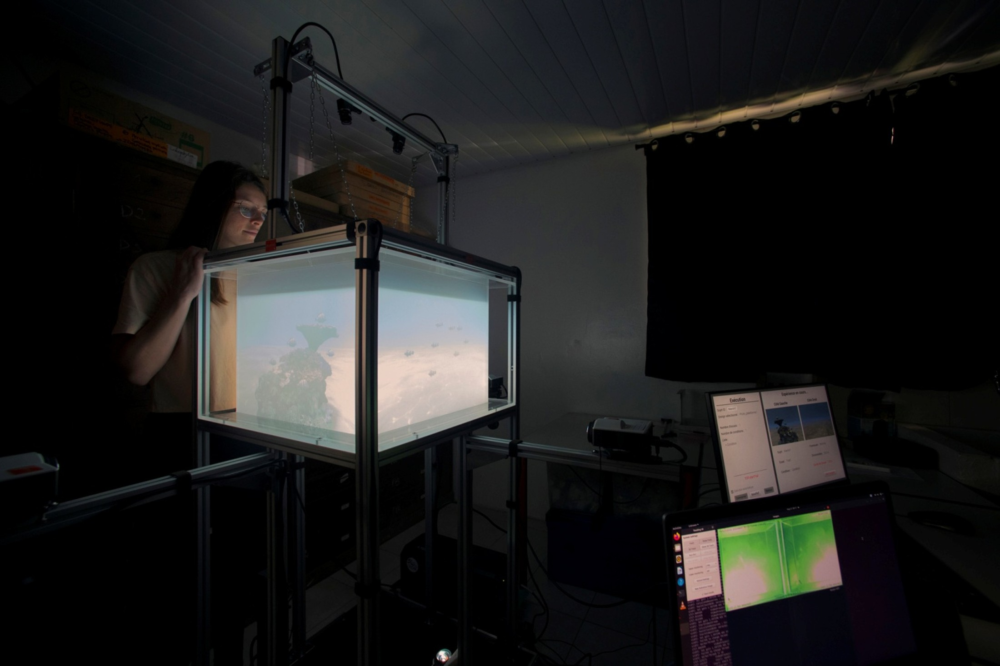
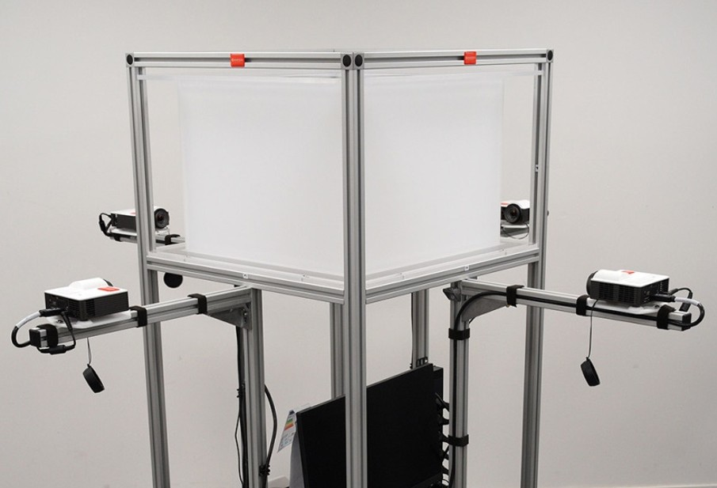
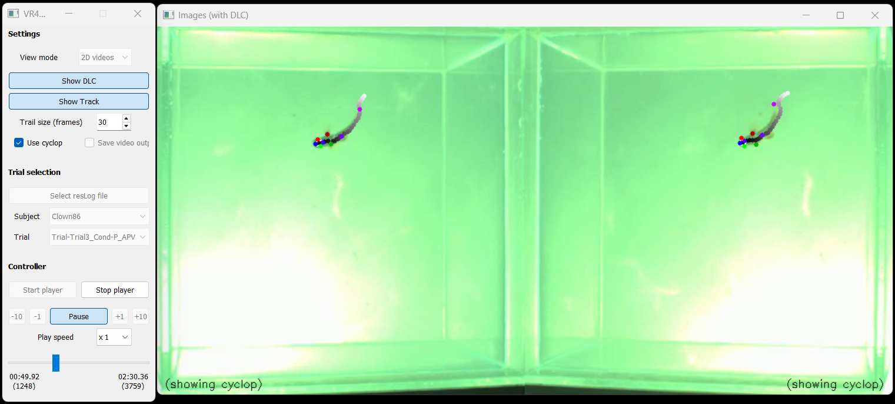
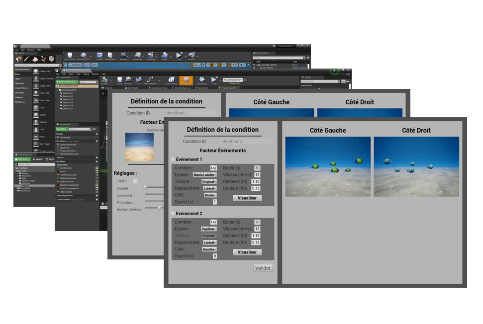

# NemoVR

NemoVR is an immersive Virtual Reality platform developed for behavioral experiments in freely swimming reef fish.

The system combines real-time tracking, virtual environment rendering and automated behavioral analysis in a closed-loop experimental framework.

---

## Overview

NemoVR is composed of two interconnected computers.

| Computer     | Operating System | Main Responsibilities                             |
| ------------ | ---------------- | ------------------------------------------------- |
| Tracking PC  | Ubuntu Linux     | Detection, tracking and behavioral analysis       |
| Rendering PC | Windows          | Unreal Engine, experiment control and visualization |

The platform is organized around four main software modules.

| Module      | Computer     | Role                                                  |
| ----------- | ------------ | ----------------------------------------------------- |
| Calibration | Tracking PC  | Camera calibration and system setup                   |
| Tracking    | Tracking PC  | Real-time fish detection and tracking                 |
| Rendering   | Rendering PC | VR environment rendering with Unreal Engine           |
| Viewer      | Rendering PC | Experiment replay, visualization and post-processing  |

---

## System Diagram

*Documentation coming soon.*

---

## Documentation

-   

    ## [Quick Start](quick-start.md)

    Learn how to start the complete NemoVR system and launch an experiment.

-   

    ## [Hardware](hardware.md)

    Description of the experimental setup, cameras, computers and acquisition hardware.

-   

    ## [Viewer](software/viewer/index.md)

    Visualization, replay and post-processing tools for tracking experiments.

-   

    ## [Software architecture](software/index.md)

    Overview of the NemoVR software modules.

---

## Software Modules

| Module         | Computer     | Repository | Documentation                             |
| -------------- | ------------ | ---------- |-------------------------------------------|
| 🎯 Calibration | Tracking PC  | Coming soon | Coming soon                               |
| 🐟 Tracking    | Tracking PC  | Coming soon | Coming soon                               |
| 🧊 Rendering   | Rendering PC | Coming soon | Coming soon                               |
| 🖥️ Viewer     | Rendering PC | [GitHub](https://github.com/ANR-BrAInVR/NemoVR-Viewer){ target="_blank" rel="noopener" } | [Documentation](software/viewer/index.md) |

---

!!! info
NemoVR is under active development. Documentation will be updated progressively as each software module is stabilized.