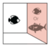

# NemoVR

NemoVR is a Virtual Reality platform designed to study the behavior of reef fish in immersive and controlled environments.

The platform combines underwater acquisition systems, behavioral tracking, AI-based analysis and virtual environment rendering.

---

## Overview

NemoVR integrates:

- Underwater camera systems
- Fish tracking pipelines
- Deep learning-based behavioral analysis
- Virtual environment rendering
- Experimental control software

---

## Documentation

### Quick Start

Installation and first experiment.

### Hardware

Acquisition systems, cameras, computers and network architecture.

### Software

Tracking, rendering and analysis tools.

### Troubleshooting

Common issues and recovery procedures.

---

## Status

NemoVR is currently under active development.